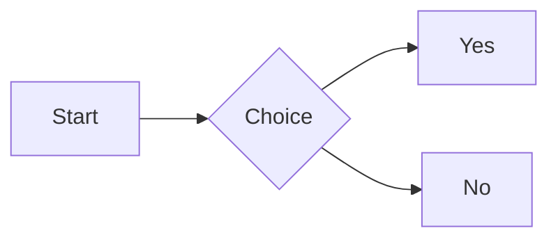

# MarkNote

## 1. Quick Start

- MarkNote is a cross-platform Markdown note app for macOS, Windows, and Linux.
- After launching, you can manage notes and files within the same workspace (folder).
- The main UI includes the file tree, editor, sidebar panels (Outline / Tags / Backlinks / Graph), and status bar.

---

## 2. Editing Modes

MarkNote provides multiple views that you can switch as needed:

- **WYSIWYG (default)**: visual editing with syntax hidden.
- **Source Mode**: plain Markdown text with syntax highlighting.
- **Focus Mode**: dim non-focused paragraphs; adjustable opacity.
- **Typewriter Mode**: keep the cursor centered vertically.

**Quick actions**

- **Command Palette**: `Cmd/Ctrl + Shift + P` to search all actions.
- **Quick Insert**: type `/` at line start to open 24 insert options.
- **Formatting Toolbar**: appears when selecting text (bold, italic, link, clear formatting, etc.).

---

## 3. Common Markdown Syntax

````markdown
# Heading 1

## Heading 2

**Bold** / _Italic_ / ~~Strikethrough~~ / ==Highlight==

- Unordered list

1. Ordered list

- [ ] Task
- [x] Done

`Inline code`

```js
console.log("Code block");
```

[Link text](https://example.com)

````

---

## 4. Diagrams & Visuals

Supports multiple diagram syntaxes. Example:

````markdown

````

Also supported: Nomnoml, PlantUML, Excalidraw, Flowchart.js, Sequence, Vega-Lite, Markmap.

---

## 5. Knowledge Features

- **Wiki links**: `[[filename]]` or `[[filename|label]]` for quick navigation.
- **Backlinks**: sidebar lists all notes linking to this file.
- **Tags**: use `#tag` or the `tags` field in front matter.
- **Graph View**: visualize relationships between notes.
- **Outline Panel**: auto-generated structure from headings.
- **[TOC]**: insert `[TOC]` to generate a clickable table of contents.

---

## 6. Files & Workspace Management

- Create, rename, move, delete files and folders.
- Drag-and-drop in the file tree to organize.
- **Tabs**: files with the same name are disambiguated by path.
- **Multi-window**: each workspace can open in its own window.

---

## 7. Search & Replace

- **Quick Open**: `Cmd/Ctrl + P`
- **Global Search**: `Cmd/Ctrl + Shift + F`, supports regex.
- **Find & Replace**: `Cmd/Ctrl + F` / `Cmd/Ctrl + Shift + H`
- **Search Highlight**: all matches are highlighted in real time.

---

## 8. Export & Presentation

**Export formats**

- HTML (with selectable export themes)
- PDF (page size configurable)
- DOCX
- Images (PNG / JPG / WebP / SVG)

**Presentation mode**

- Use `---` to separate slides
- Supports transitions, slide numbers, and a progress bar
- Navigate with arrow keys or spacebar

---

## 9. Templates

Built-in templates (Blank, Daily Note, Meeting Notes, Project Plan), plus custom templates:

- **Global templates**: `~/.MarkNote/templates/`
- **Workspace templates**: `<workspace>/_templates/`

Template variables are auto-replaced (e.g., `{{date}}`, `{{time}}`, `{{title}}`).

---

## 10. Themes & Appearance

**Import a custom theme**

1. Settings → Appearance → Import a `.css` theme file
2. Or manually place it in the theme folder and reload

Theme folders:

- macOS / Linux: `~/.MarkNote/themes/`
- Windows: `C:\Users\<username>\.MarkNote\themes\`

---

## 11. Common Shortcuts (Condensed)

| Action                  | Shortcut                                |
| ----------------------- | --------------------------------------- |
| Command Palette         | `F1`                                    |
| Quick Open              | `Cmd/Ctrl + P`                          |
| Find / Replace          | `Cmd/Ctrl + F` / `Cmd/Ctrl + Shift + H` |
| Global Search           | `Cmd/Ctrl + Shift + F`                  |
| Export                  | `Cmd/Ctrl + Shift + E`                  |
| Settings                | `Cmd/Ctrl + ,`                          |
| Toggle Source Mode      | `Cmd/Ctrl + /`                          |
| Focus / Typewriter Mode | `F8` / `F9`                             |

The full shortcut list can be viewed and customized in Settings.

---

## 12. Pro Features (Unlocked with License)

The following features are available with a Pro license (per README):

- Advanced diagrams (Nomnoml / Vega / Excalidraw, etc.)
- Math formulas (KaTeX)
- Presentation mode
- Custom themes
- Graph view
