<div align="center">
  <h1>MarkNote</h1>
  <p>
    MarkNote 是一款現代化、以本機優先（local-first）為核心、支援 macOS、Windows 與 Linux 的跨平台 Markdown 編輯器。
  </p>
  <a href="./README.md">English</a> |
  <a href="./README.zh-TW.md">正體中文</a>
</div>

## 目錄

- [目錄](#目錄)
- [1. 快速開始](#1-快速開始)
  - [安裝](#安裝)
  - [建立或開啟工作區](#建立或開啟工作區)
- [2. 工作區與介面概覽](#2-工作區與介面概覽)
- [3. 編輯模式](#3-編輯模式)
- [4. 日常 Markdown 用法](#4-日常-markdown-用法)
  - [常見語法（範例）](#常見語法範例)
  - [Callout 提示區塊](#callout-提示區塊)
  - [Front Matter（YAML）](#front-matteryaml)
  - [表格](#表格)
  - [行內目錄](#行內目錄)
- [5. 圖表與視覺化](#5-圖表與視覺化)
  - [支援的圖表類型](#支援的圖表類型)
  - [Mermaid 範例（可直接複製貼上）](#mermaid-範例可直接複製貼上)
    - [流程圖 / 圖形](#流程圖--圖形)
    - [序列圖](#序列圖)
    - [類別圖](#類別圖)
    - [狀態圖](#狀態圖)
    - [ER 圖](#er-圖)
    - [甘特圖](#甘特圖)
    - [圓餅圖](#圓餅圖)
    - [使用者旅程圖](#使用者旅程圖)
    - [Git 圖](#git-圖)
    - [心智圖](#心智圖)
    - [時間線](#時間線)
    - [象限圖](#象限圖)
    - [XY 圖](#xy-圖)
    - [Sankey 圖](#sankey-圖)
    - [區塊圖](#區塊圖)
  - [Nomnoml 範例（可直接複製貼上）](#nomnoml-範例可直接複製貼上)
    - [分類器總覽](#分類器總覽)
    - [類別圖](#類別圖-1)
    - [關係類型](#關係類型)
    - [元件圖](#元件圖)
    - [搭配樣式指令](#搭配樣式指令)
  - [PlantUML 範例（可直接複製貼上）](#plantuml-範例可直接複製貼上)
    - [序列圖](#序列圖-1)
    - [使用案例圖](#使用案例圖)
    - [類別圖](#類別圖-2)
    - [活動圖](#活動圖)
    - [元件圖](#元件圖-1)
    - [狀態圖](#狀態圖-1)
    - [部署圖](#部署圖)
    - [物件圖](#物件圖)
    - [心智圖](#心智圖-1)
    - [甘特圖](#甘特圖-1)
    - [JSON / YAML 視覺化](#json--yaml-視覺化)
  - [Excalidraw 範例（可直接複製貼上）](#excalidraw-範例可直接複製貼上)
  - [Flowchart.js 範例（可直接複製貼上）](#flowchartjs-範例可直接複製貼上)
    - [所有節點類型範例](#所有節點類型範例)
    - [最小範例（`flow` 語法）](#最小範例flow-語法)
  - [Sequence（js-sequence-diagrams）範例（可直接複製貼上）](#sequencejs-sequence-diagrams範例可直接複製貼上)
  - [Vega-Lite 範例（可直接複製貼上）](#vega-lite-範例可直接複製貼上)
    - [長條圖](#長條圖)
    - [折線圖](#折線圖)
    - [區域圖](#區域圖)
    - [散佈圖（circle）](#散佈圖circle)
    - [圓餅圖 / 甜甜圈圖（arc）](#圓餅圖--甜甜圈圖arc)
    - [Tick 圖](#tick-圖)
    - [熱力圖（rect）](#熱力圖rect)
    - [水平長條圖](#水平長條圖)
    - [堆疊長條圖](#堆疊長條圖)
  - [Markmap 範例（可直接複製貼上）](#markmap-範例可直接複製貼上)
    - [標題結構](#標題結構)
    - [清單與連結](#清單與連結)
- [6. 知識管理功能](#6-知識管理功能)
  - [Wiki 連結](#wiki-連結)
  - [反向連結](#反向連結)
  - [標籤](#標籤)
  - [大綱與 TOC](#大綱與-toc)
- [7. 搜尋與取代](#7-搜尋與取代)
- [8. 匯出與簡報](#8-匯出與簡報)
  - [匯出](#匯出)
  - [簡報模式](#簡報模式)
- [9. 範本](#9-範本)
- [10. 主題與外觀](#10-主題與外觀)
  - [內建主題](#內建主題)
  - [匯入自訂 CSS 主題](#匯入自訂-css-主題)
  - [建立自訂主題](#建立自訂主題)
  - [CSS 變數參考](#css-變數參考)
  - [範例主題（Tokyo Night 風格）](#範例主題tokyo-night-風格)
- [11. 快捷鍵](#11-快捷鍵)
- [12. Pro 授權（可選）](#12-pro-授權可選)
  - [啟用](#啟用)

---

## 1. 快速開始

### 安裝

- **下載**：可從專案的 [GitHub Releases](https://github.com/Cacao-s/marknote-official/releases/latest) 取得最新安裝程式。
- **Homebrew（macOS）**：

```bash
brew install cacao-s/tap/marknote
```

### 建立或開啟工作區

MarkNote 以**工作區資料夾**為單位運作。啟動後：

1. 選擇一個工作區資料夾（或建立新的）。
2. 使用檔案樹建立／開啟 Markdown 檔案（`.md`）。

---

## 2. 工作區與介面概覽

主要介面由以下部分組成：

- **檔案樹**：管理工作區內的筆記與資料夾（支援拖放）。
- **分頁**：可同時編輯多個檔案；同名檔案會以路徑區分。
- **編輯器**：WYSIWYG Markdown 編輯，不需要分割預覽。
- **側邊欄面板**：檔案 / 大綱 / 搜尋 / 原始碼控制 / 標籤 / 反向連結 / 圖譜（可用性可能依版本或授權而定）。
- **狀態列**：提供快速狀態資訊與操作。

---

## 3. 編輯模式

你可以依需求切換不同模式：

- **WYSIWYG（預設）**：視覺化編輯，Markdown 語法大多被隱藏。
- **原始碼模式**：以純 Markdown 文字搭配語法高亮顯示。
- **專注模式**：淡化未聚焦段落（透明度可設定）。
- **打字機模式**：讓游標維持在垂直置中位置（位置可設定）。

**快速操作**

- **命令面板**：`Cmd/Ctrl + Shift + P`（搜尋操作、檔案操作、格式化等）
- **快速開啟**：`Cmd/Ctrl + P`
- **快速插入**：在行首輸入 `/`（插入項目並顯示快捷提示）
- **格式工具列**：選取文字時出現（粗體 / 斜體 / 連結 / 清除格式等）

---

## 4. 日常 Markdown 用法

### 常見語法（範例）

````markdown
# 標題 1

## 標題 2

**粗體** / _斜體_ / ~~刪除線~~ / ==高亮==

- 無序清單

1. 有序清單

- [ ] 待辦事項
- [x] 已完成

`行內程式碼`

```js
console.log("Code block");
```

[連結文字](https://example.com)

````

### Callout 提示區塊

使用 `> [!type]` 建立帶樣式的提示區塊：

```markdown
> [!NOTE]
> 這是一則提示。

> [!WARNING]
> 這是一則警告。
```

### Front Matter（YAML）

Markdown 檔案可在開頭加入 front matter：

```markdown
---
title: "My Note"
tags: [work, reading]
---
```

### 表格

Pipe 表格在 WYSIWYG 模式下會以互動式表格元件呈現。

```markdown
| Name | Value |
| ---: | :---- |
|    A | 1     |
|    B | 2     |
```

### 行內目錄

在筆記中插入 `[TOC]`，即可根據標題自動產生可點擊的目錄。

---

## 5. 圖表與視覺化

你可以直接把以下圖表貼進 Markdown 程式碼區塊。

### 支援的圖表類型

- [Mermaid](#mermaid-範例可直接複製貼上)
- [PlantUML](#plantuml-範例可直接複製貼上)
- [Nomnoml](#nomnoml-範例可直接複製貼上)
- [Flowchart.js](#flowchartjs-範例可直接複製貼上) / [Sequence diagrams](#sequencejs-sequence-diagrams範例可直接複製貼上)
- [Excalidraw](#excalidraw-範例可直接複製貼上)
- [Vega-Lite](#vega-lite-範例可直接複製貼上)
- [Markmap mind maps](#markmap-範例可直接複製貼上)

### Mermaid 範例（可直接複製貼上）

請將 Mermaid 內容放在標記為 `mermaid` 的 fenced code block 中。

#### 流程圖 / 圖形

````markdown
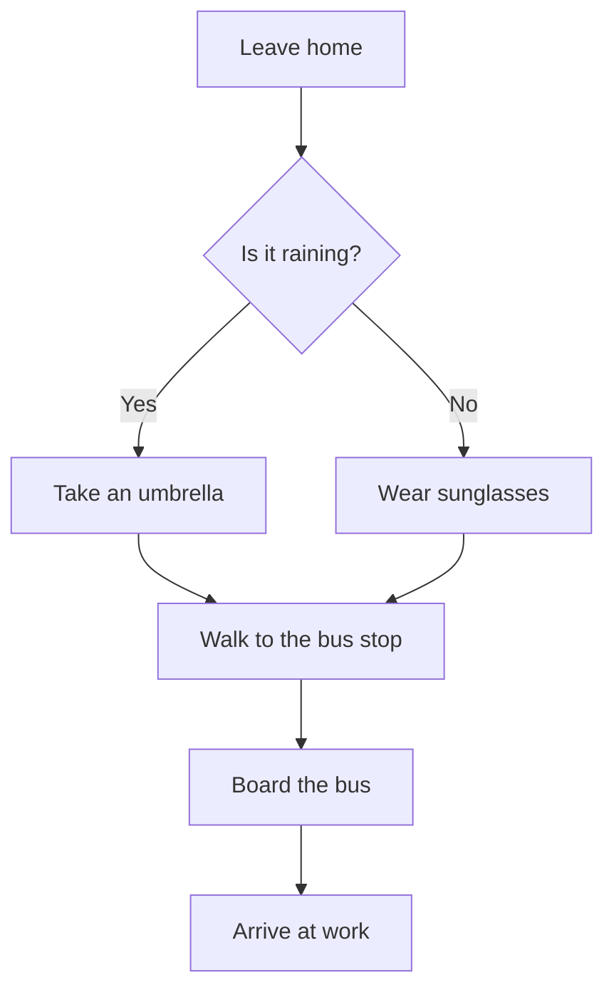
````

#### 序列圖

````markdown
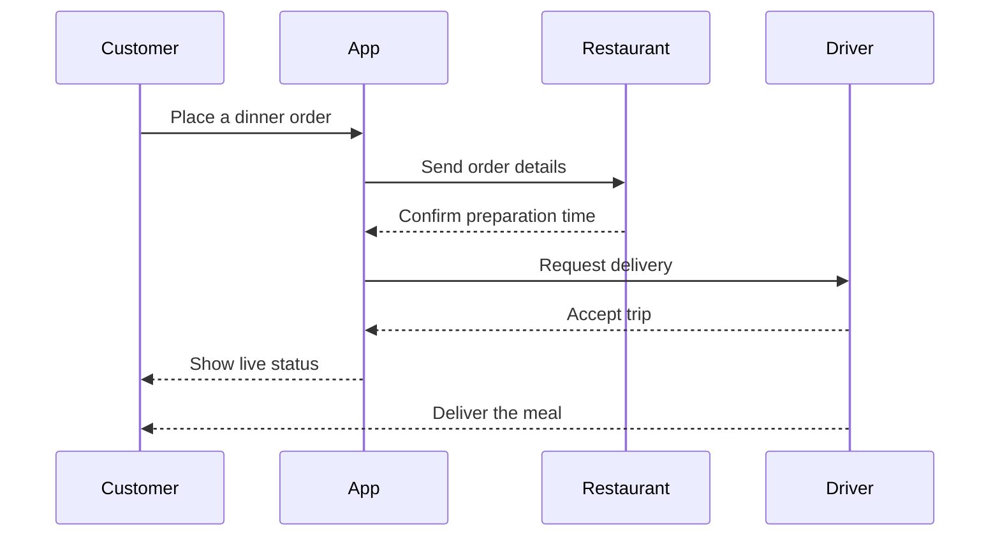
````

#### 類別圖

````markdown
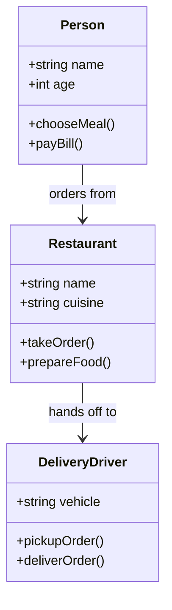
````

#### 狀態圖

````markdown
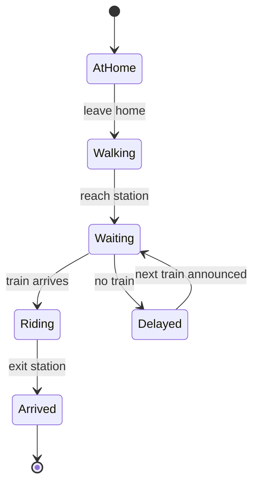
````

#### ER 圖

````markdown
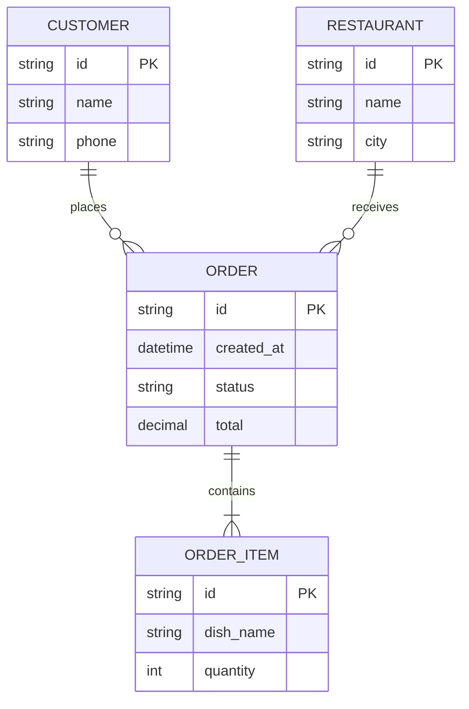
````

#### 甘特圖

````markdown
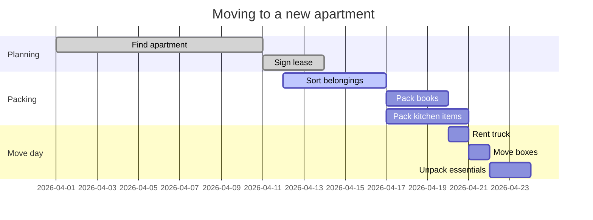
````

#### 圓餅圖

````markdown
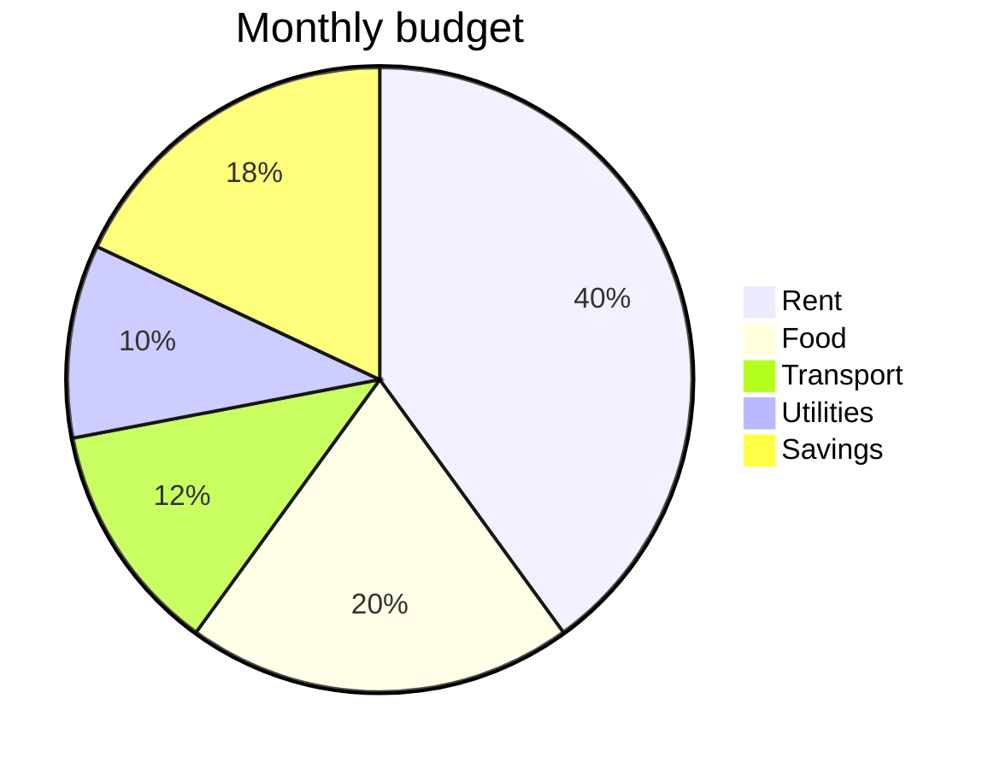
````

#### 使用者旅程圖

````markdown
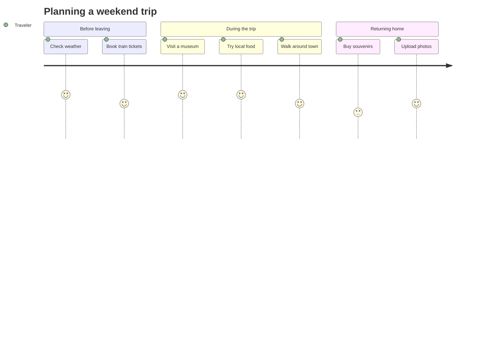
````

#### Git 圖

````markdown
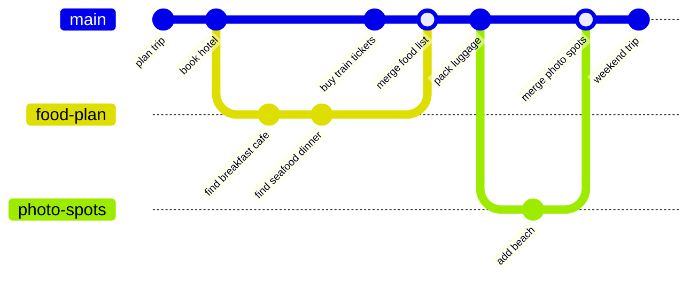
````

#### 心智圖

````markdown
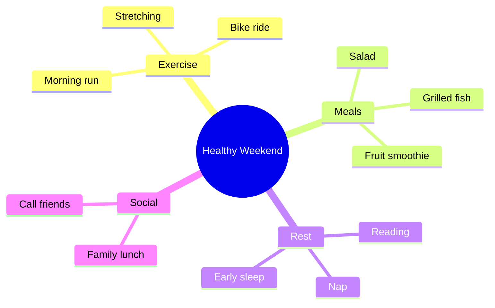
````

#### 時間線

````markdown
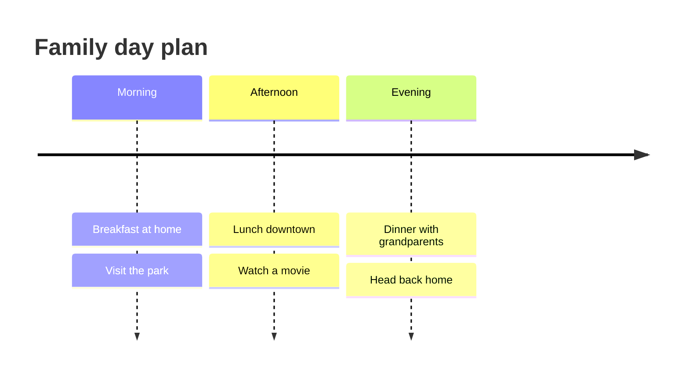
````

#### 象限圖

````markdown
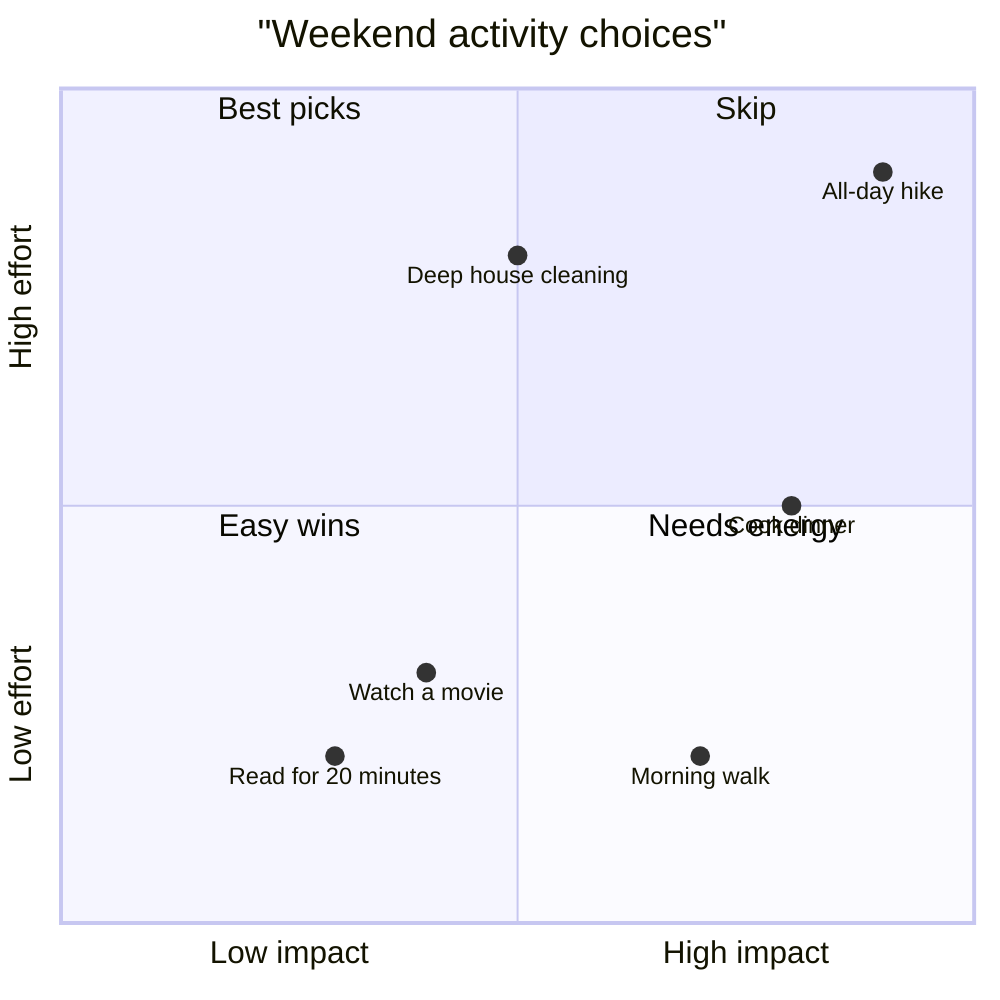
````

#### XY 圖

````markdown
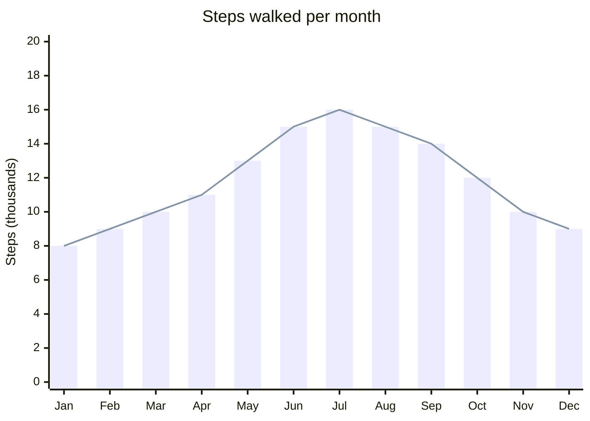
````

#### Sankey 圖

````markdown
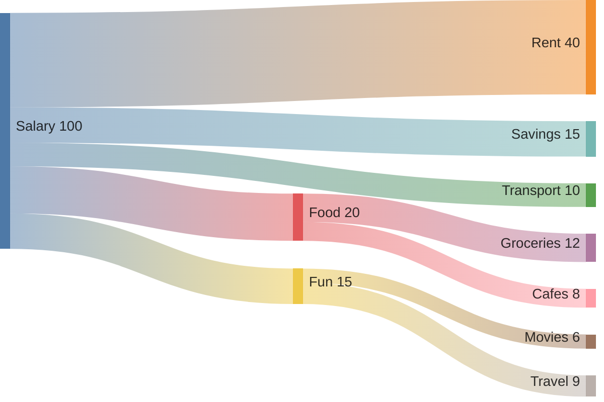
````

#### 區塊圖

````markdown
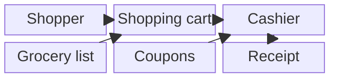
````

### Nomnoml 範例（可直接複製貼上）

請將 Nomnoml 內容放在標記為 `nomnoml` 的 fenced code block 中。

#### 分類器總覽

````markdown
```nomnoml
[<actor> User]
[<abstract> AbstractClass]
[<instance> Instance]
[<note> This is a note]
[<reference> ExternalRef]
[<package> Package]
[<frame> Frame]
[<database> Database]
[<start> s]
[<end> e]
[<state> State]
[<choice> Choice]
[<sender> Sender]
[<receiver> Receiver]
[<transceiver> Transceiver]
[<table> Name | Field1 | Field2]
```
````

#### 類別圖

````markdown
```nomnoml
[<frame> MVC |
  [<abstract> Model |
    +data: any
    +validate()
    +save()
  ]
  [<abstract> View |
    +render()
    +update()
  ]
  [<abstract> Controller |
    +handleInput()
    +updateModel()
  ]
  [Controller] -> [Model]
  [Controller] -> [View]
  [Model] --> [View]
]
```
````

#### 關係類型

````markdown
```nomnoml
[Association] -> [Target]
[Dependency] --> [Target2]
[Generalization] -:> [Base]
[Implementation] --:> [Interface]
[Composition] +- [Part]
[Aggregation] o- [Element]
```
````

#### 元件圖

````markdown
```nomnoml
[<package> Coffee Shop |
  [<component> Counter |
    [Menu]
    [Cash register]
  ]
  [<component> Kitchen |
    [Coffee machine]
    [Order queue]
  ]
  [<database> Inventory]
  [Counter] -> [Kitchen]
  [Kitchen] -> [Inventory]
]
```
````

#### 搭配樣式指令

````markdown
```nomnoml
#direction: right
#spacing: 60
#padding: 12
#fontSize: 13
#lineWidth: 2
#edges: rounded
#fill: #f5f5f7; #e8e8ed
#stroke: #1d1d1f

[Customer] -> [Order Form]
[Order Form] -> [Kitchen]
[Kitchen] -> [Pickup Shelf]
[Pickup Shelf] -> [Customer]
```
````

### PlantUML 範例（可直接複製貼上）

依你的設定，PlantUML 可能會透過遠端 PlantUML server 進行渲染。
請將 PlantUML 內容放在標記為 `plantuml` 的 fenced code block 中。

#### 序列圖

````markdown
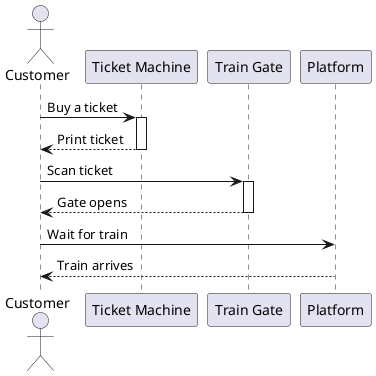
````

#### 使用案例圖

````markdown
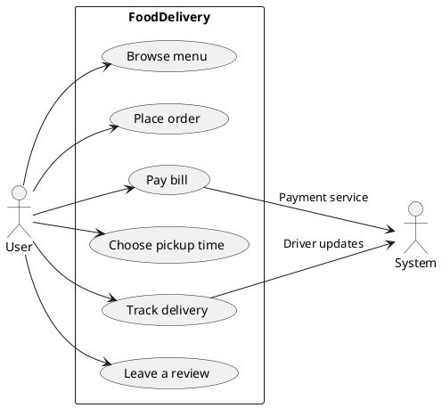
````

#### 類別圖

````markdown
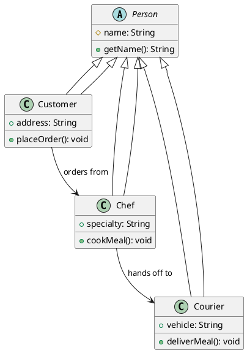
````

#### 活動圖

````markdown
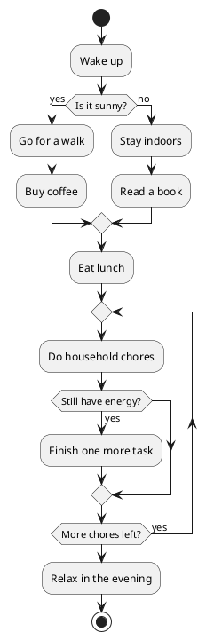
````

#### 元件圖

````markdown
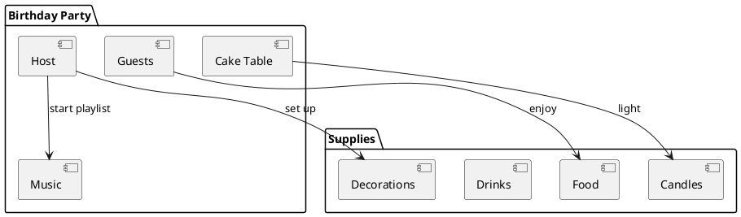
````

#### 狀態圖

````markdown
```plantuml
@startuml
[*] --> Hungry
Hungry --> Ordering : pick a restaurant
Ordering --> Waiting : place order
Waiting --> Eating : food arrives
Eating --> Full : finish meal
Waiting --> Canceled : restaurant cancels
Canceled --> Ordering : choose another place
Full --> [*]
@enduml
```
````

#### 部署圖

````markdown
```plantuml
@startuml
node "Home" {
  artifact "Smart TV" as tv
  component "Wi-Fi Router" as router
  component "Phone" as phone

  phone --> router : control app
  tv --> router : stream video
}

cloud "External services" {
  [Movie Service] as stream
}

router --> stream : internet access
@enduml
```
````

#### 物件圖

````markdown
```plantuml
@startuml
object "shoppingCart" as cart {
  items = [Milk, Eggs, Bread]
  total = 18.50
  paid = false
}

object "customer" as customer {
  name = "Ava"
  member = true
}

object "cashier" as cashier {
  lane = 3
  open = true
}

customer --> cart : owns
cashier --> cart : checks out
@enduml
```
````

#### 心智圖

````markdown
```plantuml
@startmindmap
* Vacation Plan
** Beach
*** Swim
*** Read
*** Take photos
** Food
*** Breakfast cafe
*** Seafood dinner
** Transport
*** Train
*** Taxi
** Packing
*** Clothes
*** Charger
*** Sunscreen
@endmindmap
```
````

#### 甘特圖

````markdown
```plantuml
@startgantt
Project starts 2024-01-01
[Book flights] lasts 3 days
[Reserve hotel] starts at [Book flights]'s end and lasts 2 days
[Plan places to visit] starts at [Reserve hotel]'s end and lasts 5 days
[Pack bags] starts 2024-01-15 and lasts 2 days
[Airport transfer] starts at [Pack bags]'s end and lasts 1 days
@endgantt
```
````

#### JSON / YAML 視覺化

````markdown
```plantuml
@startjson
{
  "trip": "Weekend in Kyoto",
  "travelers": 2,
  "hotel": {
    "nights": 3,
    "breakfastIncluded": true
  },
  "activities": ["temple", "market", "museum"]
}
@endjson
```
````

### Excalidraw 範例（可直接複製貼上）

Excalidraw 是一種互動式、手繪風格的圖表。雙擊區塊即可開啟全螢幕編輯器。
請將 Excalidraw JSON 放在標記為 `excalidraw` 的 fenced code block 中。

````markdown
```excalidraw
{
  "elements": [
    {
      "type": "rectangle",
      "id": "rect1",
      "x": 100,
      "y": 50,
      "width": 200,
      "height": 80,
      "strokeColor": "#1e1e1e",
      "backgroundColor": "#a5d8ff",
      "fillStyle": "solid",
      "strokeWidth": 2,
      "roughness": 1,
      "opacity": 100,
      "angle": 0,
      "seed": 1,
      "version": 2,
      "versionNonce": 556311005,
      "isDeleted": false,
      "groupIds": [],
      "boundElements": [],
      "link": null,
      "locked": false,
      "index": "a0",
      "strokeStyle": "solid",
      "frameId": null,
      "roundness": null,
      "updated": 1774488029077
    },
    {
      "type": "ellipse",
      "id": "ellipse1",
      "x": 125,
      "y": 200,
      "width": 150,
      "height": 70,
      "strokeColor": "#1e1e1e",
      "backgroundColor": "#b2f2bb",
      "fillStyle": "solid",
      "strokeWidth": 2,
      "roughness": 1,
      "opacity": 100,
      "angle": 0,
      "seed": 2,
      "version": 3,
      "versionNonce": 1572057853,
      "isDeleted": false,
      "groupIds": [],
      "boundElements": [
        {
          "type": "text",
          "id": "rKyd0yn7kUi0lrTJOvX-J"
        }
      ],
      "link": null,
      "locked": false,
      "index": "a1",
      "strokeStyle": "solid",
      "frameId": null,
      "roundness": null,
      "updated": 1774488034408
    },
    {
      "id": "rKyd0yn7kUi0lrTJOvX-J",
      "type": "text",
      "x": 172.18867109850893,
      "y": 222.25126265847084,
      "width": 55.556640625,
      "height": 25,
      "angle": 0,
      "strokeColor": "#1e1e1e",
      "backgroundColor": "transparent",
      "fillStyle": "solid",
      "strokeWidth": 2,
      "strokeStyle": "solid",
      "roughness": 1,
      "opacity": 100,
      "groupIds": [],
      "frameId": null,
      "index": "a1V",
      "roundness": null,
      "seed": 1058403763,
      "version": 10,
      "versionNonce": 224758461,
      "isDeleted": false,
      "boundElements": null,
      "updated": 1774488043860,
      "link": null,
      "locked": false,
      "text": "School",
      "fontSize": 20,
      "fontFamily": 5,
      "textAlign": "center",
      "verticalAlign": "middle",
      "containerId": "ellipse1",
      "originalText": "School",
      "autoResize": true,
      "lineHeight": 1.25
    },
    {
      "type": "text",
      "id": "text1",
      "x": 145,
      "y": 80,
      "width": 110,
      "height": 25,
      "strokeColor": "#1e1e1e",
      "backgroundColor": "transparent",
      "fillStyle": "solid",
      "strokeWidth": 1,
      "roughness": 0,
      "opacity": 100,
      "angle": 0,
      "seed": 4,
      "version": 2,
      "versionNonce": 2060607037,
      "isDeleted": false,
      "groupIds": [],
      "boundElements": [],
      "link": null,
      "locked": false,
      "text": "Leave Home",
      "fontSize": 20,
      "fontFamily": 1,
      "textAlign": "center",
      "verticalAlign": "middle",
      "baseline": 18,
      "index": "a2",
      "strokeStyle": "solid",
      "frameId": null,
      "roundness": null,
      "updated": 1774488029077,
      "containerId": null,
      "originalText": "Leave Home",
      "autoResize": true,
      "lineHeight": 1.25
    },
    {
      "type": "arrow",
      "id": "arrow1",
      "x": 200,
      "y": 130,
      "width": 0,
      "height": 70,
      "points": [
        [
          0,
          0
        ],
        [
          0,
          70
        ]
      ],
      "strokeColor": "#1e1e1e",
      "fillStyle": "solid",
      "strokeWidth": 2,
      "roughness": 1,
      "opacity": 100,
      "angle": 0,
      "seed": 3,
      "version": 2,
      "versionNonce": 414674963,
      "isDeleted": false,
      "groupIds": [],
      "boundElements": [],
      "link": null,
      "locked": false,
      "startBinding": null,
      "endBinding": null,
      "startArrowhead": null,
      "endArrowhead": "arrow",
      "lastCommittedPoint": null,
      "index": "a3",
      "strokeStyle": "solid",
      "backgroundColor": "transparent",
      "frameId": null,
      "roundness": null,
      "updated": 1774488029077
    }
  ],
  "appState": {
    "viewBackgroundColor": "#ffffff",
    "gridSize": 20,
    "gridStep": 5,
    "currentItemStrokeColor": "#1e1e1e",
    "currentItemBackgroundColor": "transparent",
    "currentItemFillStyle": "solid",
    "currentItemStrokeWidth": 2,
    "currentItemRoughness": 1,
    "currentItemOpacity": 100,
    "currentItemFontFamily": 5,
    "currentItemFontSize": 20,
    "currentItemTextAlign": "left"
  },
  "files": {}
}
```
````

提示：大多數情況下，建議使用全螢幕編輯器繪製，而不是直接手動修改 JSON。

### Flowchart.js 範例（可直接複製貼上）

程式碼區塊標籤可使用 `flowchart` 或 `flow`。

#### 所有節點類型範例

````markdown
```flowchart
st=>start: Start
io_in=>inputoutput: Enter shopping list
op1=>operation: Visit the supermarket
sub=>subroutine: Check weekly coupons
cond=>condition: Is milk on sale?
para=>parallel: Split tasks
op2=>operation: Buy fruit
op3=>operation: Buy bread
io_out=>inputoutput: Bring groceries home
e=>end: End

st->io_in->op1->sub->cond
cond(yes)->para
cond(no, left)->op1
para(path1, left)->op2->io_out
para(path2, right)->op3->io_out
io_out->e
```
````

#### 最小範例（`flow` 語法）

````markdown
```flow
st=>start: Start
e=>end: End
op=>operation: Make tea
cond=>condition: Add sugar?

st->op->cond
cond(yes)->e
cond(no)->op
```
````

### Sequence（js-sequence-diagrams）範例（可直接複製貼上）

請將 sequence 內容放在標記為 `sequence` 的 fenced code block 中。

````markdown
```sequence
participant Customer as C
participant Waiter as W
participant Kitchen as K
participant Cashier as P

C->W: Order lunch
W->K: Send ticket
Note right of K: Prepare meal
K-->W: Dish ready
W-->C: Serve food
Note over C,W: Customer eats
C->P: Pay the bill
P-->C: Receipt
```
````

### Vega-Lite 範例（可直接複製貼上）

Vega-Lite 是以 JSON 撰寫的宣告式圖表規格。程式碼區塊標籤可使用 `vega-lite` 或 `vega`。

#### 長條圖

````markdown
```vega-lite
{
  "$schema": "https://vega.github.io/schema/vega-lite/v5.json",
  "title": "Favorite fruit by household",
  "width": 300,
  "data": {
    "values": [
      {"fruit": "Apple", "score": 12},
      {"fruit": "Banana", "score": 9},
      {"fruit": "Orange", "score": 7},
      {"fruit": "Mango", "score": 5},
      {"fruit": "Grapes", "score": 8}
    ]
  },
  "mark": "bar",
  "encoding": {
    "x": {"field": "fruit", "type": "nominal", "title": "Fruit"},
    "y": {"field": "score", "type": "quantitative", "title": "Votes"},
    "color": {"field": "fruit", "type": "nominal", "legend": null}
  }
}
```
````

#### 折線圖

````markdown
```vega-lite
{
  "$schema": "https://vega.github.io/schema/vega-lite/v5.json",
  "title": "Water intake per day",
  "width": 400,
  "data": {
    "values": [
      {"day": "Mon", "liters": 1.8},
      {"day": "Tue", "liters": 2.0},
      {"day": "Wed", "liters": 1.6},
      {"day": "Thu", "liters": 2.2},
      {"day": "Fri", "liters": 2.1},
      {"day": "Sat", "liters": 1.9}
    ]
  },
  "mark": {"type": "line", "point": true},
  "encoding": {
    "x": {"field": "day", "type": "ordinal", "title": "Day"},
    "y": {"field": "liters", "type": "quantitative", "title": "Liters"}
  }
}
```
````

#### 區域圖

````markdown
```vega-lite
{
  "$schema": "https://vega.github.io/schema/vega-lite/v5.json",
  "title": "Room temperature by hour",
  "width": 400,
  "data": {
    "values": [
      {"time": "06:00", "temp": 19},
      {"time": "09:00", "temp": 21},
      {"time": "12:00", "temp": 25},
      {"time": "15:00", "temp": 27},
      {"time": "18:00", "temp": 24},
      {"time": "21:00", "temp": 22}
    ]
  },
  "mark": {"type": "area", "opacity": 0.6},
  "encoding": {
    "x": {"field": "time", "type": "ordinal", "title": "Time"},
    "y": {"field": "temp", "type": "quantitative", "title": "Celsius"}
  }
}
```
````

#### 散佈圖（circle）

````markdown
```vega-lite
{
  "$schema": "https://vega.github.io/schema/vega-lite/v5.json",
  "title": "Sleep vs coffee cups",
  "width": 350,
  "height": 250,
  "data": {
    "values": [
      {"person": "Ava", "hours": 8, "coffee": 1, "steps": 9000},
      {"person": "Ben", "hours": 6, "coffee": 3, "steps": 6200},
      {"person": "Cara", "hours": 7, "coffee": 2, "steps": 8100},
      {"person": "Dylan", "hours": 5, "coffee": 4, "steps": 5400},
      {"person": "Ella", "hours": 8.5, "coffee": 1, "steps": 10300}
    ]
  },
  "mark": {"type": "circle", "opacity": 0.8},
  "encoding": {
    "x": {"field": "hours", "type": "quantitative", "title": "Hours slept"},
    "y": {"field": "coffee", "type": "quantitative", "title": "Coffee cups"},
    "size": {"field": "steps", "type": "quantitative", "title": "Steps"},
    "color": {"field": "person", "type": "nominal", "title": "Person"}
  }
}
```
````

#### 圓餅圖 / 甜甜圈圖（arc）

````markdown
```vega-lite
{
  "$schema": "https://vega.github.io/schema/vega-lite/v5.json",
  "title": "Weekend spending",
  "data": {
    "values": [
      {"category": "Food", "value": 35},
      {"category": "Transport", "value": 20},
      {"category": "Tickets", "value": 25},
      {"category": "Other", "value": 20}
    ]
  },
  "mark": {"type": "arc", "innerRadius": 50, "tooltip": true},
  "encoding": {
    "theta": {"field": "value", "type": "quantitative"},
    "color": {"field": "category", "type": "nominal", "title": "Category"}
  }
}
```
````

#### Tick 圖

````markdown
```vega-lite
{
  "$schema": "https://vega.github.io/schema/vega-lite/v5.json",
  "title": "Wait time by grocery checkout lane",
  "width": 300,
  "data": {
    "values": [
      {"lane": "Lane 1", "minutes": 4}, {"lane": "Lane 1", "minutes": 5},
      {"lane": "Lane 1", "minutes": 3}, {"lane": "Lane 1", "minutes": 6},
      {"lane": "Lane 2", "minutes": 7}, {"lane": "Lane 2", "minutes": 8},
      {"lane": "Lane 2", "minutes": 6}, {"lane": "Lane 2", "minutes": 9},
      {"lane": "Lane 3", "minutes": 2}, {"lane": "Lane 3", "minutes": 3},
      {"lane": "Lane 3", "minutes": 4}, {"lane": "Lane 3", "minutes": 2}
    ]
  },
  "mark": "tick",
  "encoding": {
    "x": {"field": "minutes", "type": "quantitative", "title": "Minutes"},
    "y": {"field": "lane", "type": "nominal", "title": "Checkout lane"},
    "color": {"field": "lane", "type": "nominal", "legend": null}
  }
}
```
````

#### 熱力圖（rect）

````markdown
```vega-lite
{
  "$schema": "https://vega.github.io/schema/vega-lite/v5.json",
  "title": "Cafe visits by day and time",
  "width": 350,
  "height": 200,
  "data": {
    "values": [
      {"day": "Mon", "time": "Morning", "count": 2},
      {"day": "Mon", "time": "Afternoon", "count": 1},
      {"day": "Tue", "time": "Morning", "count": 3},
      {"day": "Tue", "time": "Afternoon", "count": 2},
      {"day": "Wed", "time": "Morning", "count": 1},
      {"day": "Wed", "time": "Afternoon", "count": 3},
      {"day": "Thu", "time": "Morning", "count": 2},
      {"day": "Thu", "time": "Afternoon", "count": 2},
      {"day": "Fri", "time": "Morning", "count": 4},
      {"day": "Fri", "time": "Afternoon", "count": 3}
    ]
  },
  "mark": "rect",
  "encoding": {
    "x": {"field": "day", "type": "ordinal", "title": "Day"},
    "y": {"field": "time", "type": "ordinal", "title": "Time"},
    "color": {"field": "count", "type": "quantitative", "title": "Visits", "scale": {"scheme": "blues"}}
  }
}
```
````

#### 水平長條圖

````markdown
```vega-lite
{
  "$schema": "https://vega.github.io/schema/vega-lite/v5.json",
  "title": "Books read by genre",
  "width": 300,
  "data": {
    "values": [
      {"genre": "Mystery", "count": 6},
      {"genre": "Sci-Fi", "count": 4},
      {"genre": "History", "count": 3},
      {"genre": "Cooking", "count": 2},
      {"genre": "Travel", "count": 5}
    ]
  },
  "mark": "bar",
  "encoding": {
    "y": {"field": "genre", "type": "nominal", "title": "Genre", "sort": "-x"},
    "x": {"field": "count", "type": "quantitative", "title": "Books"},
    "color": {"field": "genre", "type": "nominal", "legend": null}
  }
}
```
````

#### 堆疊長條圖

````markdown
```vega-lite
{
  "$schema": "https://vega.github.io/schema/vega-lite/v5.json",
  "title": "Weekly time split",
  "width": 300,
  "data": {
    "values": [
      {"day": "Mon", "task": "Work", "hours": 8},
      {"day": "Mon", "task": "Exercise", "hours": 1},
      {"day": "Mon", "task": "Family", "hours": 3},
      {"day": "Tue", "task": "Work", "hours": 8},
      {"day": "Tue", "task": "Exercise", "hours": 1},
      {"day": "Tue", "task": "Family", "hours": 4},
      {"day": "Wed", "task": "Work", "hours": 8},
      {"day": "Wed", "task": "Exercise", "hours": 1},
      {"day": "Wed", "task": "Family", "hours": 3}
    ]
  },
  "mark": "bar",
  "encoding": {
    "x": {"field": "day", "type": "nominal", "title": "Day"},
    "y": {"field": "hours", "type": "quantitative", "title": "Hours", "stack": true},
    "color": {"field": "task", "type": "nominal", "title": "Task"}
  }
}
```
````

### Markmap 範例（可直接複製貼上）

Markmap 會根據 Markdown 標題與清單渲染心智圖。請將內容放在標記為 `markmap` 的 fenced code block 中。

#### 標題結構

````markdown
```markmap
# Family Weekend Plan

## Saturday
### Farmers market
### Lunch with friends
### Evening walk

## Sunday
### Brunch
### Museum visit
### Grocery shopping

## Things to bring
### Water bottle
### Camera
### Reusable bag
```
````

#### 清單與連結

````markdown
```markmap
# Picnic Checklist

## Food
- Sandwiches
- Fruit
- Cookies

## Essentials
- Blanket
- Water
- Sunscreen

## People
- Alex
  - Bring cups
  - Bring napkins
- Jamie
  - Bring speakers
```
````

---

## 6. 知識管理功能

### Wiki 連結

使用 `[[filename]]`（或 `[[filename|label]]`）串接筆記：

```markdown
See also: [[Architecture]]
See also: [[Architecture|Design Notes]]
```

### 反向連結

反向連結面板會列出所有連到目前筆記的其他筆記。

### 標籤

可使用行內標籤：

```markdown
#project #meeting
```

也可以透過 front matter 管理標籤：

```markdown
---
tags: [project, meeting]
---
```

### 大綱與 TOC

- **大綱面板**：根據標題自動產生結構。
- **行內 TOC**：在文件中插入 `[TOC]`。

---

## 7. 搜尋與取代

- **快速開啟**：`Cmd/Ctrl + P`
- **尋找**：`Cmd/Ctrl + F`
- **尋找與取代**：`Cmd/Ctrl + Shift + H`
- **全域搜尋**：`Cmd/Ctrl + Shift + F`（支援 regex、區分大小寫、完整單字）
- **搜尋高亮**：即時標示所有匹配結果

---

## 8. 匯出與簡報

### 匯出

可將筆記匯出為：

- **HTML**（獨立檔案；可選擇匯出主題）
- **PDF**（頁面尺寸與邊界可設定；可用 `---` 作為分頁）
- **DOCX**
- **圖片**（PNG / JPG / WebP / SVG；適合用於投影片）

注意：部分格式或選項可能依版本而需要 Pro 授權。

### 簡報模式

使用 `---` 將 Markdown 切成多張投影片：

```markdown
# Slide 1

---

# Slide 2
```

使用方向鍵或空白鍵切換。

---

## 9. 範本

內建提供範本，你也可以加入自己的範本。

範本位置：

- **全域範本**：`~/.MarkNote/templates/`
- **工作區範本**：`<workspace>/_templates/`

範本範例：

```markdown
---
title: "Book: {{title}}"
date: { { date } }
tags: [reading]
---

# {{title}}

**Author**:
**Rating**:

## Summary

## Key Takeaways

1.
```

---

## 10. 主題與外觀

### 內建主題

MarkNote 支援淺色 / 深色 / 跟隨系統主題。

### 匯入自訂 CSS 主題

1. 到 Settings -> Appearance -> Import，選擇 `.css` 主題檔
2. 或將檔案放進主題資料夾後重新載入

主題資料夾位置：

- macOS / Linux：`~/.MarkNote/themes/`
- Windows：`C:\Users\<username>\.MarkNote\themes\`

### 建立自訂主題

自訂主題就是一般 CSS 檔案。

- 主題檔必須使用選擇器 `:root[data-theme="custom"]` 並覆寫 CSS 變數。
- 檔名（不含 `.css`）會成為 UI 顯示的主題名稱（例如 `tokyo-night.css` 會顯示為 "Tokyo Night"）。

### CSS 變數參考

**核心色彩**

| Variable           | Meaning                        |
| ------------------ | ------------------------------ |
| `--bg-primary`     | 主要背景（編輯器、面板）       |
| `--bg-secondary`   | 次要背景（側邊欄、輸入框）     |
| `--bg-tertiary`    | 第三級背景（hover 狀態、標籤） |
| `--text-primary`   | 主要文字顏色                   |
| `--text-secondary` | 次要 / 淡化文字顏色            |
| `--accent`         | 強調色（連結、選取、按鈕）     |
| `--border`         | 邊框顏色                       |
| `--hover`          | hover 高亮（半透明）           |
| `--selection`      | 文字選取高亮（半透明）         |

**語意色彩**

| Variable    | Meaning          |
| ----------- | ---------------- |
| `--error`   | 錯誤、破壞性操作 |
| `--warning` | 警告             |
| `--success` | 成功狀態、確認   |

**陰影**

| Variable            | Meaning      |
| ------------------- | ------------ |
| `--shadow-dropdown` | 下拉選單陰影 |
| `--shadow-modal`    | 對話框陰影   |

**語法高亮**

| Variable        | Meaning                              |
| --------------- | ------------------------------------ |
| `--hl-keyword`  | 關鍵字（`if`、`return`、`const` 等） |
| `--hl-atom`     | 原子值 / 常數（`true`、`null` 等）   |
| `--hl-string`   | 字串常值                             |
| `--hl-comment`  | 註解                                 |
| `--hl-meta`     | Meta / 預處理器指令                  |
| `--hl-tag`      | HTML/XML 標籤                        |
| `--hl-variable` | 變數                                 |
| `--hl-regexp`   | 正規表示式                           |
| `--hl-link`     | 連結 / URL                           |
| `--hl-invalid`  | 無效 / 錯誤 token                    |

### 範例主題（Tokyo Night 風格）

```css
/* Tokyo Night - MarkNote custom theme */
:root[data-theme="custom"] {
	/* Core backgrounds */
	--bg-primary: #1a1b26;
	--bg-secondary: #16161e;
	--bg-tertiary: #24283b;
	--text-primary: #c0caf5;
	--text-secondary: #565f89;
	--accent: #7aa2f7;
	--border: #292e42;
	--hover: rgba(122, 162, 247, 0.1);
	--selection: rgba(122, 162, 247, 0.25);

	/* Semantic colors */
	--error: #f7768e;
	--warning: #e0af68;
	--success: #9ece6a;

	/* Shadows */
	--shadow-dropdown: 0 4px 16px rgba(0, 0, 0, 0.5);
	--shadow-modal: 0 8px 32px rgba(0, 0, 0, 0.6);

	/* Syntax highlighting */
	--hl-keyword: #bb9af7;
	--hl-atom: #7dcfff;
	--hl-string: #9ece6a;
	--hl-comment: #565f89;
	--hl-meta: #6a7094;
	--hl-tag: #f7768e;
	--hl-variable: #7dcfff;
	--hl-regexp: #e0af68;
	--hl-link: #73daca;
	--hl-invalid: #db4b4b;
}
```

---

## 11. 快捷鍵

`Cmd` 用於 macOS；`Ctrl` 用於 Windows/Linux。快捷鍵可在 Settings 中自訂。

| Action             | Shortcut               |
| ------------------ | ---------------------- |
| Command Palette    | `F1`                   |
| Quick Open         | `Cmd/Ctrl + P`         |
| Find               | `Cmd/Ctrl + F`         |
| Find & Replace     | `Cmd/Ctrl + Shift + H` |
| Global Search      | `Cmd/Ctrl + Shift + F` |
| Toggle Sidebar     | `Cmd/Ctrl + Shift + B` |
| Export             | `Cmd/Ctrl + Shift + E` |
| Presentation Mode  | `Cmd/Ctrl + Shift + P` |
| Settings           | `Cmd/Ctrl + ,`         |
| Toggle Source Mode | `Cmd/Ctrl + /`         |
| Focus / Typewriter | `F8` / `F9`            |

若要查看更完整的快捷鍵列表，請參考 `README.md` 的「Shortcuts」章節。

---

## 12. Pro 授權（可選）

部分進階功能可透過 Pro 授權解鎖（例如：進階圖表、數學公式渲染、Graph view 等知識面板、簡報模式、自訂主題）。

### 啟用

1. 開啟 MarkNote
2. 前往 Settings -> License
3. 貼上你的授權金鑰
4. 點擊「Activate」

你的授權金鑰可在 Polar 購買頁面取得。
